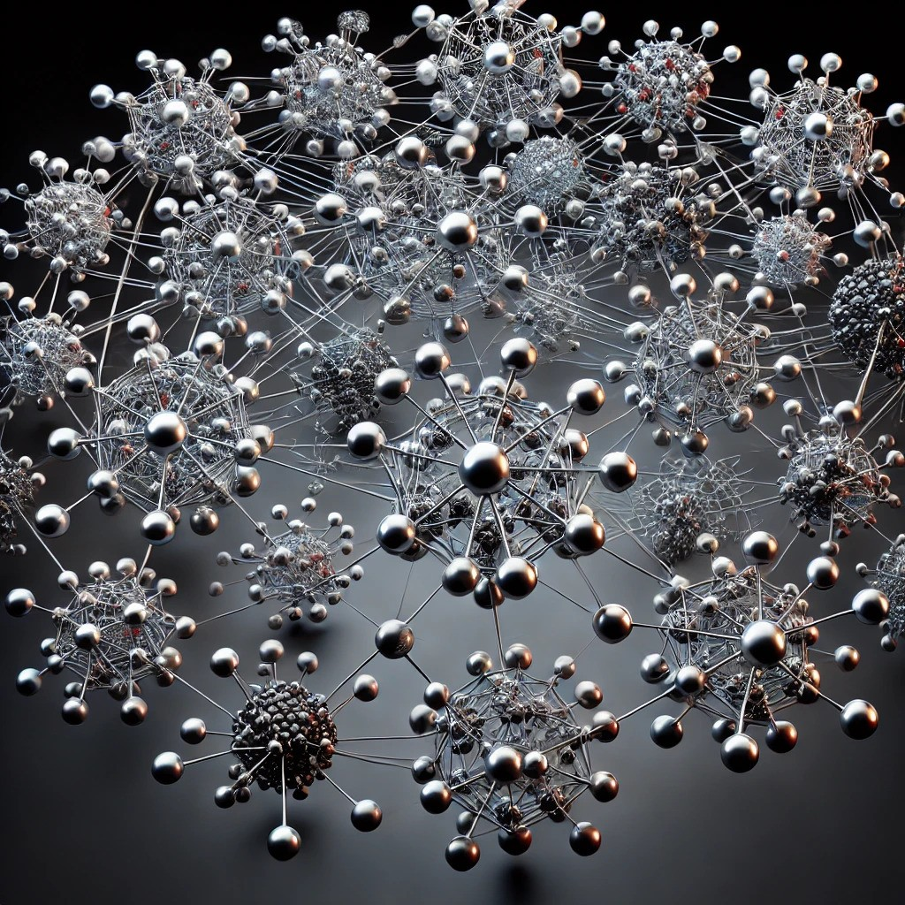

# Generating Nodes in a Social Network using GANs

This repository contains code for generating node representations in a social network using Generative Adversarial Networks (GANs). GANs are utilized to learn the underlying distribution of nodes in a graph, allowing for the generation of new, realistic node representations that can be used for various downstream tasks in social network analysis.

## Overview

In social network analysis, understanding the structure and characteristics of nodes (individual entities) is crucial for tasks such as recommendation systems, community detection, and link prediction. Traditional methods often rely on handcrafted features or embeddings generated from simple algorithms like node2vec or DeepWalk. This project explores the use of GANs to generate node representations that capture complex dependencies and structures present in social networks.

## Repository Structure

- `data/`: Placeholder for dataset (not included due to size)
- `models/`: Implementation of GAN models for node generation
- `utils/`: Utility functions for data preprocessing and evaluation
- `node_generation.ipynb`: Jupyter notebook demonstrating node generation process
- `requirements.txt`: List of dependencies for reproducing the environment

## Usage

1. **Clone the repository:**

